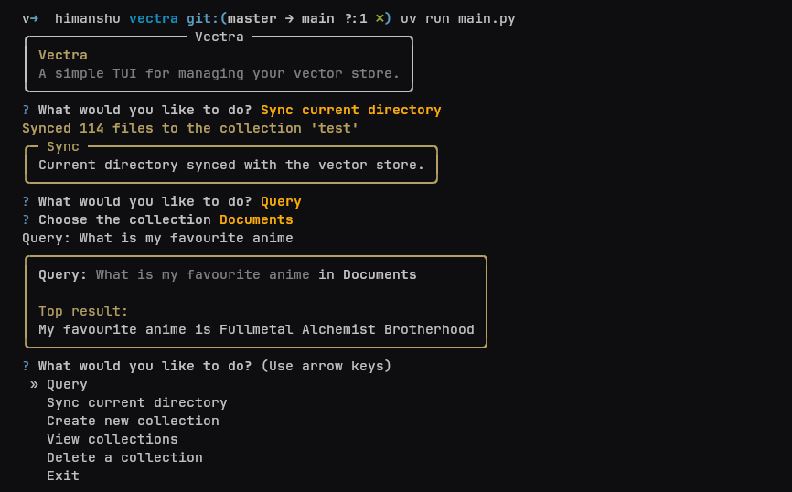

# 🧠 Vectra

Vectra is a lightweight terminal-based interface for managing vector stores — starting with ChromaDB, with plans to support other backends. It helps you create, query, and organize collections of embedded documents through an intuitive TUI.

 

## ⚙️ Features

- 🔍 Query documents via semantic similarity
- 🗂️ Create, list, and delete collections
- 📄 View stored documents
- 📦 Powered by ChromaDB with pluggable vector DB support (soon)
- 🤖 Easy to integrate into other Python tools (e.g., web frameworks)

## 🚀 Getting Started

### Installation

```bash
git clone https://github.com/yourusername/vectra.git
cd vectra

# using pip
pip install -r requirements.txt

# using uv
uv add -r requirements.txt
````

> Make sure you have Python 3.8+ and `chromadb` installed.

### Running

```bash
python main.py

# or
uv run main.py
```

You’ll be greeted with an interactive interface where you can create collections, add/query documents, and manage your vector DB.

## 🛠 Tech Stack

* [Python 3.8+](https://www.python.org/)
* [ChromaDB](https://www.trychroma.com/)
* [Rich](https://github.com/Textualize/rich) for terminal rendering
* [Questionary](https://github.com/tmbo/questionary) for interactive prompts

## 🗺 Roadmap

Here's what we plan to build next:

* [x] Basic TUI structure with Rich
* [x] Integration with ChromaDB
* [x] Collection creation/deletion/listing
* [x] Basic querying via CLI
* [ ] Add document support (with metadata)
* [ ] Multi-result querying
* [ ] Pluggable embedder support (`sentence-transformers`, OpenAI, Cohere, etc.)
* [ ] Multiple vector DB backends (Qdrant, Weaviate)
* [ ] Export/import collections
* [ ] Search history
* [ ] Optional CLI (non-TUI) interface
* [ ] Optional web mode via FastAPI wrapper
* [ ] PyPI release (`pip install vectra`)

## 🤝 Contributing

Pull requests, ideas, and feedback are welcome! Just open an issue or fork the repo.

